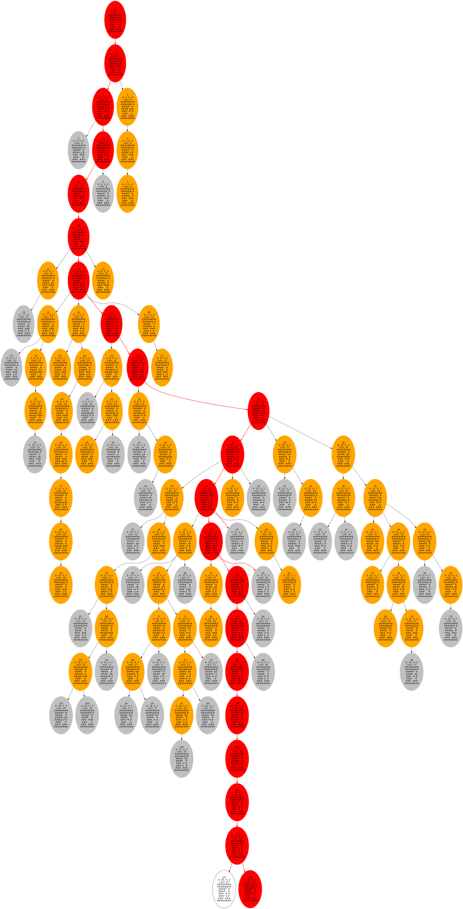

Sokoban solver
==============

So far can't do much, I am more playing with the language than trying to write a good solver. It can currently solve only level 1 of the original Sokoban levels because they tend to be large and require goalroom optimizations. It, however, chews through even difficult small levels like [microban](https://gitlab.com/martin-t/sokoban-solver/-/tree/master/levels/microban1) faster than any human ever could.

Some parts are intentionally more general than they need to be so that I can properly test Rust's generics:

- There are 2 level formats (the standard XSB/SOK plus a custom one) for both input and output
- It can solve normal Sokoban levels or "remover" levels (they have exactly one goal spot which eats boxes pushed onto it)
- It can look for both move and push optimal solutions

The original goal was to help me with level 100 of the game [Supaplex](https://en.wikipedia.org/wiki/Supaplex) which is inspired by Sokoban level 43. This is much easier with a remover because there is no need for goalroom optimizations. The version with a remover can be solved in a few seconds, with goals it takes significantly longer and takes much more memory. Similarly, more of the original Sokoban levels can be solved when the goals are replaced with a remover.

Can generate graphs to visualize the searched state space:

*Pack Microban, level 79*

---

*Pack 696, level 1, older visualization format*

Method
------

Currently uses A* with push distances to nearest goal (or remover) as heuristic. The only deadlock detection is a result of this - boxes on dead end cells have no way to reach any goals.

Installation
------------

Requires nightly (will be installed automatically thanks to the `rust-toolchain` file).

Development
-----------

Optionally use `git config core.hooksPath git-hooks` to check the code before committing.

License
-------

Everything except `levels/` is licensed under AGPLv3 or later.
